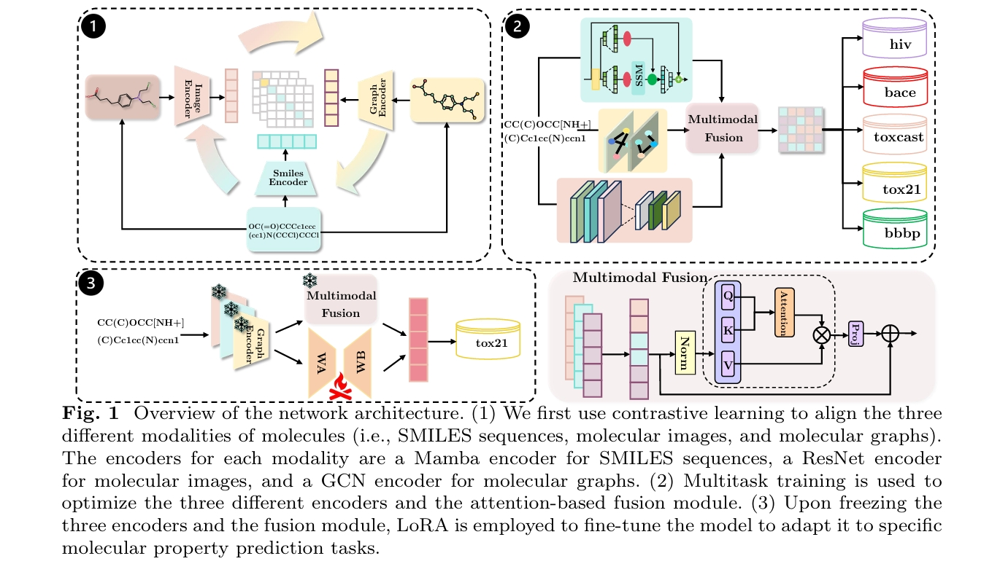

# **Three-Modality Molecular Representation Learning Combined with Multi-Task Optimization for Enhanced Molecular Property Prediction**




# Install environment

#### 1. create a new conda environment

*conda* *env* *create* -f env.yaml

conda activate MolTriFusion

## Pretraining

#### 1. preparing dataset

Download data

[MPP](https://drive.google.com/file/d/1hzsMxZ8QtcpmL1lQFsqtEXl4qr4KcZdg/view?usp=sharing)

[CYP450](https://drive.google.com/file/d/1C6sdmdG71QElo2A95LyCPOkpfqWiyz8n/view?usp=sharing)

[SARS-CoV-2](https://drive.google.com/file/d/1R2LTYmjrEr6qLCGPrqdTMIUH5Zf-eRRq/view?usp=sharing)

 put it into `./data_process/data/`

Training dataset for contrastive learning [images](https://drive.google.com/file/d/1TAQEOK4YnBdHO-CF07Sr1xrL_m9gXLWE/view?usp=drive_link) ,put it into `./data/images/`

# Train

## Training Smiles with Mamba Model

```
python train_smiles_mamba.py
```

## Train data using a 6-layer GCN model

You can train the GCN_train.py by using the following command:

```
python GCN_train.py --datasetname ${datasetname} \
                   --csv_path ${csv_path} 
```

For example:

```
python GCN_train.py --datasetname BBBP \
                   --csv_path data_process/data/BBBP/processed/BBBP_processed_ac.csv
```

# Comparative learning

First, place the pretrained dataset([images](https://drive.google.com/file/d/1TAQEOK4YnBdHO-CF07Sr1xrL_m9gXLWE/view?usp=sharing)) for contrastive learning in the ./data/image directory

and 

You can train the contrast.py by using the following command:

```
python contrast.py --datasetname ${datasetname} \
                   --csv_path ${csv_path} 
```

For example:

```
python contrast.py --datasetname BBBP \
                   --csv_path data_process/data/BBBP/processed/BBBP_processed_ac.csv
```


# Finetuning

#### 1. Download pre-trained model

You can download [pre-trained model](https://drive.google.com/file/d/1GN350mDKzoJH4R8KdQYswnONYtGH1r4W/view?usp=drive_link) and push it into the folder `ckpts/`

#### 2. Finetune with pre-trained model

 You can run finetune by simply using the following code:

```
python finetune.py --gpu ${gpu_no} \
                   --save_finetune_ckpt ${save_finetune_ckpt} \
                   --log_dir ${log_dir} \
                   --dataroot ${dataroot} \
                   --dataset ${dataset} \
                   --task_type ${task_type} \
                   --resume ${resume} \
                   --image_aug \
                   --lr ${lr} \
                   --batch ${batch} \
                   --epochs ${epoch}
```

For example:

```
python finetune.py --gpu 0 \
                   --save_finetune_ckpt 1 \
                   --log_dir ./logs/bbbp \
                   --dataroot ./datasets/finetuning/benchmarks \
                   --dataset bbbp \
                   --task_type classification \
                   --resume ./ckpts/ImageMol.pth.tar \
                   --image_aug \
                   --lr 0.5 \
                   --batch 64 \
                   --epochs 20
```


# Evaluate models

You can evaluate the finetuned model by using the following command:

```
python evaluate.py --dataroot ${dataroot} \
                   --dataset ${dataset} \
                   --task_type ${task_type} \
                   --resume ${resume} \
                   --batch ${batch}
```

For example:

```
python evaluate.py --dataroot ./datasets/finetuning/benchmarks \
                   --dataset bbbp \
                   --task_type classification \
                   --resume ./bbbp.pth \
                   --batch 128
```

